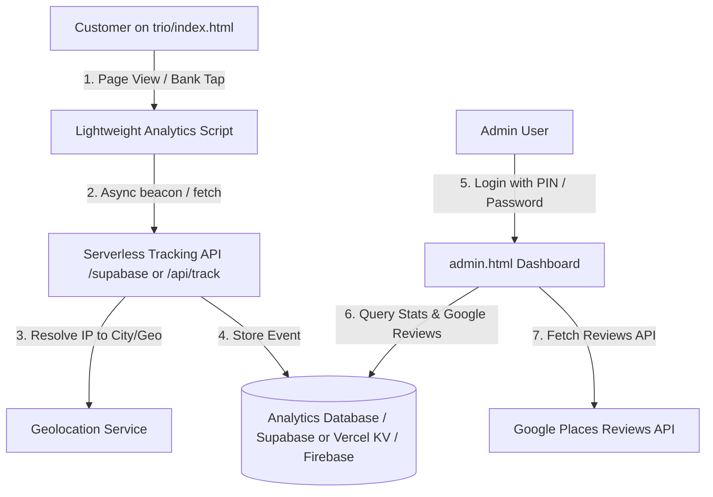

# Implementation Plan: Visitor Analytics & Admin Dashboard

Provide real-time visitor traffic analytics, geographic & device insights, and customer feedback/Google Reviews tracking for **Trio Kitchen**.

## What Can & Cannot Be Collected in Modern Browsers

> [!IMPORTANT]
> **Understanding Privacy & Browser Capabilities:**
> - **Visitor Count, IP Address, Location (City, Region, Country), Device/Browser & Referrer:** **Yes, 100% possible.** We can capture IP addresses on the server/API layer and look up city/region/country data, recording visits and button clicks (e.g. which bank was tapped, Interac email copy events).
> - **Google Account Name / Google Identity:** **Browsers do not share a visitor's private Google account or Google review profile automatically** when they browse a webpage (blocked by browser sandboxing & privacy laws).
> - **How to capture customer names & Google reviews for marketing:**
>   1. **Google Places / My Business Reviews API Integration:** Fetch and display real public Google reviews & reviewer names on your admin dashboard and website.
>   2. **"Leave a Review / VIP Discount" Form:** Let customers submit their name / phone / review link or email for loyalty discounts.
>   3. **Interac Checkout / Review Prompt:** Capture customer details when they interact with the menu or copy the payment email.

---

## Architecture Overview

---

## Proposed Implementation

### 1. Tracking Engine (`assets/js/tracker.js` or inline)
- Lightweight, zero-lag async tracking script added to [index.html](file:///d:/dev/trio/index.html).
- Captures:
  - Page views & unique visitor tokens (stored in localStorage)
  - IP address, Country, Region, City, ISP
  - Device type (iOS, Android, Desktop), Browser, Screen size
  - Source / Referrer (Instagram, Google Search, QR Code flyer, Direct)
  - Key business conversions: `Bank Tapped (RBC/TD/BMO/etc.)`, `Interac Email Copied`, `Dish Added to Cart`

### 2. Backend & Data Storage (Options)
- **Option A (Recommended - Supabase / Free Tier):** Full PostgreSQL with auto REST API, zero server maintenance, real-time updates.
- **Option B (Vercel Serverless Functions + SQLite/Postgres or KV):** Keeps everything inside the existing `.vercel` deployment.
- **Option C (Lightweight Firebase / Supabase client):** Direct secure logging without complex backend servers.

### 3. Password-Protected Admin Dashboard (`admin.html`)
- Dedicated, password/PIN-protected page designed with Trio Kitchen's signature aesthetic.
- **Key Dashboard Cards & Metrics:**
  - 📊 **Traffic & Visits Overview:** Daily/Weekly/Monthly unique visitors, live active sessions.
  - 🗺️ **Geographic Map & Breakdown:** City/Region level (e.g. Toronto, Mississauga, Brampton, Vancouver).
  - 📱 **Device & Marketing Source:** Instagram vs Google vs Direct, Mobile vs Desktop.
  - 🛒 **Funnel & Intent Analytics:** How many people copied Interac email, which dishes were ordered most.
  - ⭐ **Google Reviews Section:** Latest customer reviews, ratings, reviewer names, sentiment score, and direct reply links.
  - 📥 **Export to CSV:** One-click download for marketing and campaign analysis.

---

## User Review & Decision Required

> [!NOTE]
> Please confirm your preferred backend stack and Google review setup:
> 1. **Backend Database:** Would you prefer **Supabase** (free, easy setup, great dashboard), **Firebase**, or **Vercel Serverless API**?
> 2. **Admin Security:** Simple PIN / Admin Password or Full Email Login?
> 3. **Google Place ID:** Do you have an existing Google Business Place ID or Google Maps link for Trio Kitchen to pull reviews automatically?

---

## Verification Plan
1. **Event Capture Test:** Visit [index.html](file:///d:/dev/trio/index.html) from different simulated devices / IPs and confirm events are recorded.
2. **Action Tracking:** Tap banks and copy Interac email; verify action events appear in dashboard.
3. **Admin Dashboard UI:** Test filtering by date range, reviewing location breakdown, and testing PIN authentication.
